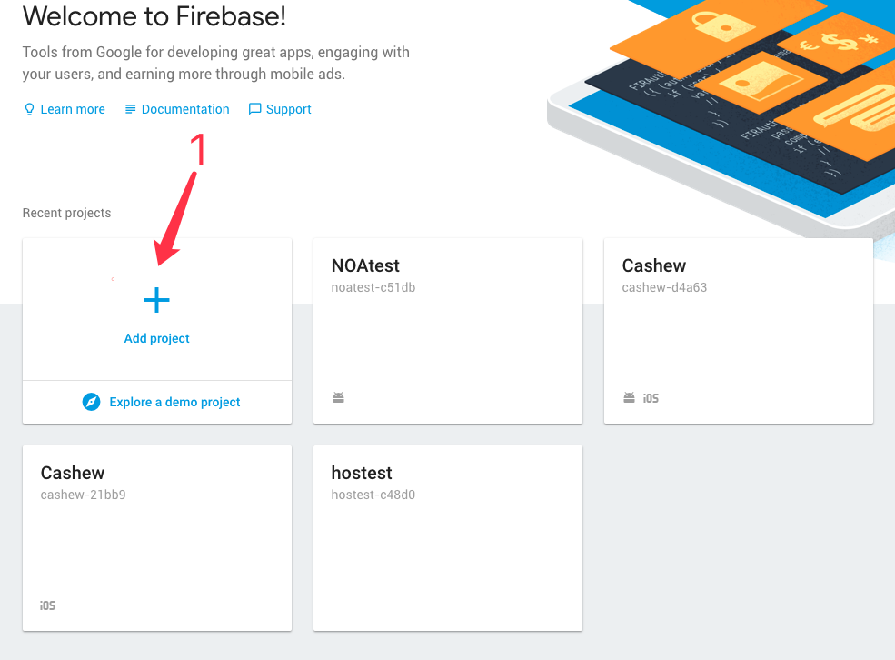
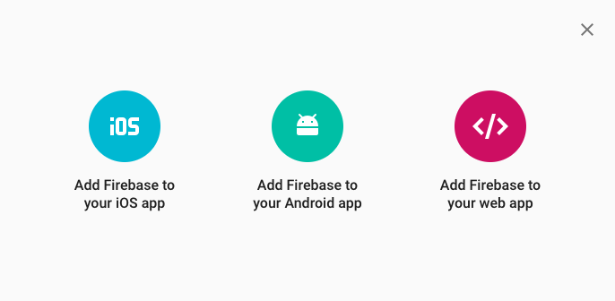
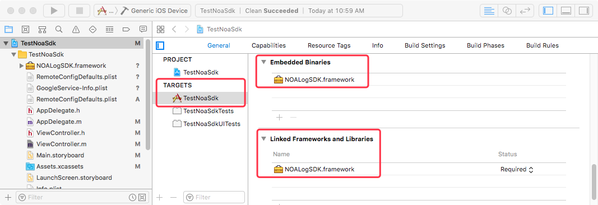
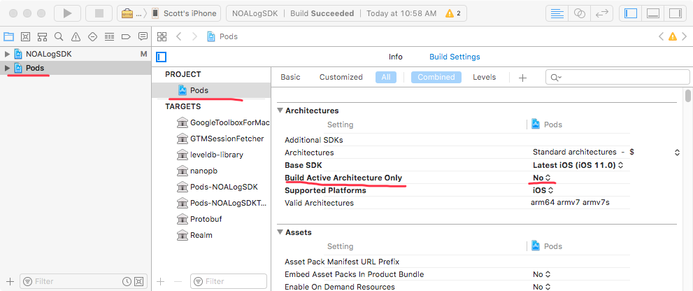
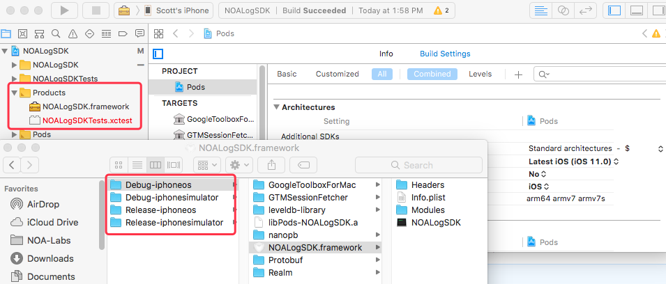

[Requirements analysis and design documentation](https://docs.google.com/document/d/1bhLFBYWt21CVOHjdmSrGNTnlnjCNu37eBZhBsOOnINU/edit)   

[Debug and Customer Support Check the documentation](https://github.com/NOA-Labs/Remote-debug-Android/blob/master/structure.md)

Welcome to NOA-Labs IOS Remote Log SDK, The following will be the usage of SDK.   
> [1 Sign up for a Firebase account](#1-sign-up-for-a-firebase-account)
>
> [2 Create a Project in Firebase](#2-create-a-project-in-firebase)
>
> [3 Add App to Firebase's Project](#3-add-app-to-firebases-project)
>
> > [3.1 Android](#31-add-android-app)
>
> > [3.2 IOS](#32-add-ios-app)
>
> [4 How to use SDK in the App](#4-how-to-use-sdk-in-the-app)
>
> > [4.1 Android](#41-android)
>
> > [4.2 IOS](#42-ios)
>
> > > [4.2.1 How to Add NOA IOS Remote SDK to App](#421-how-to-add-noa-ios-remote-sdk-to-app) 
>
> > > [4.2.2 How to use IOS SDK in the app](#422-how-to-use-ios-sdk-in-the-app)
>
> [5 How to compile SDK source code and Precautions](#5-how-to-compile-sdk-source-code-and-precautions)
>  
> > [5.1 Android](#51-android)
>
> > [5.2 IOS](#52-ios)
>
# NOA-Labs Remote Log SDK usage
## 1 Sign up for a Firebase account  
如果你已经存在[Firebase](firebase.google.com)账号, 请忽略并查看第二步操作   
如果你不存在[Firebase](firebase.google.com)帐号,请前往该网址进行注册[https://firebase.google.com/](https://firebase.google.com/)
   
## 2 Create a Project in Firebase   
为需要记录的App或者其他类型的Project创建一个Project。   

## 3 Add App to Firebase's Project
1. 点击你创建的Project,进入Project的管理界面
2. 点击Project Overview右侧的，进入Project settings界面
3. 在Your apps的下方点击ADD APP   

### 3.1 Add Android App
1. 点击Android, 加入Android App
2. 写入Android package name, App nickname等信息，然后注册App到Project下面
3. 注册成功之后在下一个page下载google-service.json,然后将其移到App的根目录下
4. 如果你忘记下载google-service.json,也可以在Your apps下面找到，并重新下载
### 3.2 Add IOS App
1. 点击IOS,加入IOS APP
2. 写入各项真实信息,例如bundle ID,App nickname等, 然后注册App到Project下面
3. 注册成功之后在下一个page下载GoogleService-Info.plist,移到你的APP工程中,注意APP的bundle ID一定要与上述的bundle ID一致
4. 如果你忘记下载GoogleService-Info.plist,也可以在Your apps下面找到，并重新下载
## 4 How to use SDK in the App
### 4.1 Android
#### 4.2.1 How to Add NOA Android Remote SDK to App
1. 将noalog源码加入App的同一个工程的目录下面
2. 在Project的根目录下的settings.gradle加入
```

include ':noalog'
include ':你的APP'
...

```
3. 在你App的根目录build.gradle中引入SDK,如下
```
...

dependencies {
    ...

    implementation project(':noalog')
    
    ...
}

...

```
4. 然后点击上方的,之后就可以调用了
#### 4.2.2 How to use Android SDK in the app
1. 在Application中的onCreate初始化日志的服务
```
...

public class App extends Application {
     @Override
     public void onCreate() {
        super.onCreate();
        NOALogService.init(this);
        ....
     }
}

....

```
2. 保存各种类型数据的用法和[API](https://noa-scott.github.io/debug-api/)   
<font face="微软雅黑" color=#DC143C size=5>备注：</font>建议在上层应用中重新建立一个类封装各种数据保存的用法, 1. 为了自己更清晰和明白对应方法的含义或者简化方法名称, 2. 当程序比较成熟,并且极少出现bug,为了减少App的大小,我们需要移除SDK，避免为了到处删除SDK的引用此时可以使用一个类封装，当出现这种情况，仅仅需要删除封装类中的方法
```
/**
* 各种方法的使用, 在需要的地方调用即可
*/
public void test(){
    // 保存用户反馈的方法, msg 表示用户反馈的信息, 
    // 调用之方法之后,同时会将本地其他信息也同步提交到�服务器中
    Nag.feedback(msg);

    /**
    * 保存用户信息
    * 保存用户的信息是json格式, 不同的应用用户表的字段可能也不同,因此使用json保存比较适配各种情况
    */
    Nag.user(msg);

    /**
    * 保存信息到文件中
    */
    Nag.file(msg);

    // 划分不明确的信息
    Nag.other(msg);

    //保存用户点击或者跳转界面的信息
    Nag.event(msg);

    // 保存信息到记录中
    // type MsgType 
    Nag.r1(MsgType,key,msg);
}


package com.noa.log.entity;

/**
 *
 * @Company: NOA-Labs
 * @Author： Scott Wang
 * @Time：  
 * @Description： 
 *
 */

public enum MsgType {
    LOGIN("Login",0), CONFIG("Config",1), PERMISSIONS("Permissions",2), CONNECT("Connect",3), MESSAGE("Message",4), OTHER("Other",5);

    public String getName() {
        return name;
    }

    public void setName(String name) {
        this.name = name;
    }

    public int getIndex() {
        return index;
    }

    public void setIndex(int index) {
        this.index = index;
    }

    private String name;
    private int index;
    // 构造方法
    MsgType(String name, int index) {
        this.name = name;
        this.index = index;
    }
}

```

### 4.2 IOS
#### 4.2.1 How to Add NOA IOS Remote SDK to App
将NOALogSDK.framework文件引入需要的App中，然后查看在如下图中是否存在引用,如果没有请加入引用
   
在需要使用的文件中导入头部文件
```
#import <NOALogSDK/NOALogSDK.h>
```
#### 4.2.2 How to use IOS SDK in the app
1. 初始化IOS Remote SDK的服务   
在IOS didFinishLaunchingWithOptions中初始化SDK,初始化的方法为[NOALogService configure];
```

- (BOOL)application:(UIApplication *)application didFinishLaunchingWithOptions:(NSDictionary *)launchOptions {
    // Override point for customization after application launch.
    
    [NOALogService configure];
    return YES;
}

```

2. 保存各种类型数据的用法   
<font face="微软雅黑" color=#DC143C size=5>备注：</font>建议在上层应用中重新建立一个类封装各种数据保存的用法, 1. 为了自己更清晰和明白对应方法的含义, 2. 当程序比较成熟,并且极少出现bug,为了减少App的大小,我们需要移除SDK，避免为了到处删除SDK的引用此时可以使用一个类封装，当出现这种情况，仅仅需要删除封装类中的方法
```
-(void)test{
    [Nag event: @"保存信息到事件中"];
    [Nag feedback:@"用户反馈信息"];
    [Nag file:@"保存本地的日志信息到文件中."];

    
    /*
     typedef NS_ENUM(NSInteger,NLRecordsMsgType){
         NLRecordsMsgTypeLogin = 0,
         NLRecordsMsgTypeConfig,
         NLRecordsMsgTypePermissions,
         NLRecordsMsgTypeConnect,
         NLRecordsMsgTypeMessage,
         NLRecordsMsgTypeOther,
     };
     */
    [Nag r1:NLRecordsMsgTypePermissions key:@"保存数据的Key值" msg:@"对应需要保存的消息"];
    
    //保存用户的信息， 此处使用的是IOS中的词典
    //第一个参数是用户的ID,必须是一个唯一值
    NSMutableDictionary *user =  [[NSMutableDictionary alloc] init];
    [user setObject:@"scott@noa-labs.com" forKey: @"email"];
    [Nag userId:@"123456" user:user];
}
```
## 5 How to compile SDK source code and Precautions
### 5.1 Android
1. Android Version的SDk 支持19(4.4)及以上版本
### 5.2 IOS   
1. IOS Version的SDk 支持8.0及以上版本
2. 在编译过程中Build Active Architecture Only 为 NO    

3. 最终编译完成之后,再Products中找到SDK,右键Show in Finder中选择对应的版本(真机，虚拟机以及对应的debug和release version)    